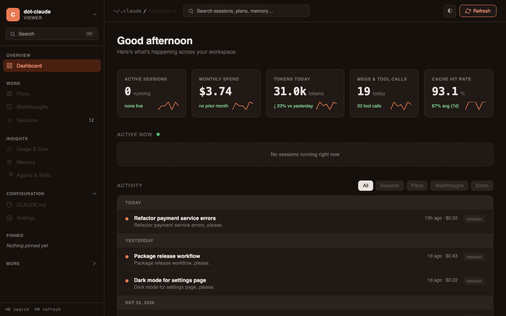

# Claude Viewer

A local web viewer for your Claude Code data in `~/.claude`: sessions, memory, plans, settings and estimated spend.

It reads your real Claude Code files, which can contain private work. It binds to 127.0.0.1 only and never uploads anything.



## Features

- Dashboard with live sessions, tokens and estimated cost today
- Browse projects and read full session transcripts
- Full-text search across sessions, memory, plans, walkthroughs and CLAUDE.md
- Cost page with 7-day token usage, monthly spend and per-model breakdown
- Memory browser and memory graph
- Skills, agents, plugins and settings pages
- Pinned sessions, keyboard shortcuts, light and dark theme

## Tech stack

Node.js, Express, vanilla ES modules frontend (no build step).

## Quick start

```
git clone https://github.com/devumang096/claude-viewer.git
cd claude-viewer
npm install && npm start
```

Opens on http://localhost:3737. Requires Node 20+.

## How it works

The Express server reads JSONL transcripts and config from `~/.claude`, sums token usage per session and model, and prices it from a small rate table in `pricing.js`. The frontend fetches JSON from the endpoints below and renders each view in the browser.

Endpoints, all `GET`: `/api/projects`, `/api/session/:dirName/:sessionId`, `/api/memory`, `/api/settings`, `/api/claude-md`, `/api/history`, `/api/live-sessions`, `/api/plans`, `/api/walkthroughs`, `/api/plugins`, `/api/skills`, `/api/agents`, `/api/stats`, `/api/costs`, `/api/search?q=`.

## Limitations

- Costs are estimates from list prices and a fixed cache multiplier, not a bill. Unknown models are priced at Sonnet rates
- Project paths are decoded from directory names on a best-effort basis, so folders with dashes in their names may display incorrectly
- Requests with a non-localhost Host header are rejected

## Tests

```
npm test
```

## License

MIT
